<picture>
  <source media="(prefers-color-scheme: dark)" srcset="dark.svg">
  <source media="(prefers-color-scheme: light)" srcset="light.svg">
  
</picture>

 

<picture>
  <source media="(prefers-color-scheme: dark)" srcset="dark_logo.svg">
  <source media="(prefers-color-scheme: light)" srcset="light_logo.svg">
  
</picture>

 

<picture>
  <source media="(prefers-color-scheme: dark)" srcset="https://skillicons.dev/icons?i=ts,react,nextjs,nodejs,python,cs,cpp,git,linux&theme=dark">
  <source media="(prefers-color-scheme: light)" srcset="https://skillicons.dev/icons?i=ts,react,nextjs,nodejs,python,cs,cpp,git,linux&theme=light">
  
</picture>
